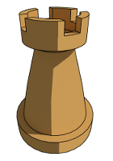
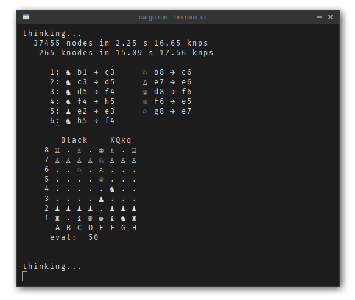

# Rook

A chess engine written in [Rust](https://www.rust-lang.org).

## Features

* Chess!
* Promotion
* Basic [negamax](https://en.wikipedia.org/wiki/Negamax) search
* Command-line client
* [UCI](https://en.wikipedia.org/wiki/Universal_Chess_Interface) for talking to UIs

## Todo

* Castling
* En passant
* Quiescence search
* Alpha-Beta pruning
* Iterative deepening
* Move ordering
* Hashing

### Screenshot

